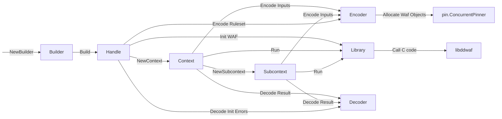

# go-libddwaf

This project's goal is to produce a higher level API for the go bindings to [libddwaf](https://github.com/DataDog/libddwaf): DataDog in-app WAF.
It consists of 2 separate entities: the bindings for the calls to libddwaf, and the encoder whose job is to convert _any_ go value to its libddwaf object representation.

An example usage would be:

```go
import waf "github.com/DataDog/go-libddwaf/v5"

//go:embed
var ruleset []byte

func main() {
    var parsedRuleset any

    if err := json.Unmarshal(ruleset, &parsedRuleset); err != nil {
        panic(err)
    }

    // v2: NewBuilder no longer takes obfuscator regex parameters
    builder, err := waf.NewBuilder()
    if err != nil {
        panic(err)
    }
    _, err := builder.AddOrUpdateConfig("/rules", parsedRuleset)
    if err != nil {
        panic(err)
    }

    wafHandle, err := builder.Build()
    if err != nil {
        panic(err)
    }
    defer wafHandle.Close()

    wafCtx, err := wafHandle.NewContext(context.Background(), timer.WithUnlimitedBudget(), timer.WithComponent("waf", "rasp"))
    if err != nil {
        panic(err)
    }
    defer wafCtx.Close()

    // v2: Use Data field instead of Persistent
    result, err := wafCtx.Run(context.Background(), waf.RunAddressData{
        Data: map[string]any{
            "server.request.path_params": "/rfiinc.txt",
        },
        TimerKey: "waf",
    })

    // v2: For ephemeral data, use NewSubcontext
    subCtx, err := wafCtx.NewSubcontext(context.Background())
    if err != nil {
        panic(err)
    }
    defer subCtx.Close()

    result, err = subCtx.Run(context.Background(), waf.RunAddressData{
        Data: map[string]any{
            "server.request.body": "ephemeral data",
        },
    })
}
```

The API documentation details can be found on [pkg.go.dev](https://pkg.go.dev/github.com/DataDog/go-libddwaf/v5).

## Upgrading from v4 to v5

go-libddwaf v5 tracks libddwaf v2 and includes a few breaking API changes:

- `NewBuilder()` no longer takes obfuscator regex arguments; obfuscation now lives in builder config via `AddOrUpdateConfig(..., "obfuscator/config", ...)`
- `RunAddressData` now uses a single `Data` field instead of `Persistent` and `Ephemeral`
- ephemeral evaluation now goes through `NewSubcontext()`
- `Context.Run`, `Handle.NewContext`, and `Context.NewSubcontext` now require a `context.Context`
- `Builder.Build()` now returns `(*Handle, error)`
- `WAFObject` and `WAFObjectKV` are now opaque structs wrapping internal types
- The `Encodable` interface's `Encode` method now takes `*WAFObject` and `EncoderConfig` instead of `*bindings.WAFObject`
- The internal `depthOf` function now takes a `timer.Timer` instead of relying on `context.Background()`

### Migration Guide

The v5 update introduces a more ergonomic and performant encoding API. Key changes include:

1.  **Type changes**: `WAFObject` and `WAFObjectKV` are now value types (type aliases to bindings). A `WAFObject{}` is a valid zero-value.
2.  **Direct field access for KV**: Use `kv.Key.SetString(pinner, "...")` and `kv.Val.SetBool(true)` directly. The `kv.Key()` and `kv.Value()` accessors have been removed.
3.  **Pinner re-export**: External `Encodable` implementers should now import `libddwaf.Pinner` instead of using `internal/pin`.
4.  **Truncations value type**: The `map[TruncationReason][]int` has been replaced by a `Truncations` value type. Use `t.StringTooLong` etc. for direct access, or `t.AsMap()` for backward compatibility.
5.  **Encoder helper**: A bundle for `Encodable` implementers that provides `WriteString`, `Map`, `Array`, and `Timeout` helpers.
6.  **MapBuilder / ArrayBuilder**: Ergonomic builders that replace the manual slice juggling and `SetMapData`/`SetArrayData` pattern.
7.  **Encodable interface change**: The new signature is `Encode(enc *Encoder, obj *WAFObject, depth int) error`. Truncations now accumulate in `enc.Truncations`.
8.  **Best-effort encoding philosophy**: Errors should be self-recovered whenever possible. Only fatal conditions like `ErrTimeout` or `ErrMaxDepthExceeded` should propagate.

**BEFORE (v4):**
```go
// BEFORE (v4) — manual slice juggling + truncation map merge dance
type Encodable struct {
    data []byte
    // ... fields elided
}

func (e *Encodable) Encode(config libddwaf.EncoderConfig, obj *libddwaf.WAFObject, remainingDepth int) (map[libddwaf.TruncationReason][]int, error) {
    truncations := map[libddwaf.TruncationReason][]int{}

    // ... manual JSON walk ...
    // For each map:
    var wafObjs []libddwaf.WAFObject
    var length int
    for /* each (key, value) */ {
        length++
        if config.Timer.Exhausted() {
            return truncations, waferrors.ErrTimeout
        }
        if len(wafObjs) >= config.MaxContainerSize {
            continue
        }
        wafObjs = append(wafObjs, libddwaf.WAFObject{})
        entryObj := &wafObjs[len(wafObjs)-1]

        // Manual key truncation
        if len(key) > config.MaxStringSize {
            truncations[libddwaf.StringTooLong] = append(
                truncations[libddwaf.StringTooLong], len(key))
            key = key[:config.MaxStringSize]
        }
        entryObj.SetMapKey(config.Pinner, key)  // v4-only method

        // ... encode value into entryObj ...
        if err := encodeValue(entryObj, value, remainingDepth-1); err != nil {
            entryObj.SetInvalid()
            continue
        }
    }
    if len(wafObjs) >= config.MaxContainerSize {
        truncations[libddwaf.ContainerTooLarge] = append(
            truncations[libddwaf.ContainerTooLarge], length)
    }
    obj.SetMapData(config.Pinner, wafObjs)
    return truncations, nil
}
```

**AFTER (v5):**
```go
// AFTER (v5) — MapBuilder + Encoder helpers handle truncation, capacity,
// key truncation, and finalization automatically.
type Encodable struct {
    data []byte
    // ... fields elided
}

func (e *Encodable) Encode(enc *libddwaf.Encoder, obj *libddwaf.WAFObject, depth int) error {
    if enc.Timeout() {
        return waferrors.ErrTimeout
    }
    if depth < 0 {
        enc.Truncations.Record(libddwaf.ObjectTooDeep, enc.Config.MaxObjectDepth-depth)
        return waferrors.ErrMaxDepthExceeded
    }

    // ... walk JSON ...
    // For each map:
    mb := enc.Map(obj)
    defer mb.Close()

    for /* each (key, value) */ {
        if enc.Timeout() {
            return waferrors.ErrTimeout
        }
        slot := mb.NextValue(key)  // auto-truncates key, returns nil at cap
        if slot == nil {
            mb.Skip()
            continue
        }
        if err := encodeValue(slot, value, depth-1); err != nil {
            slot.SetInvalid()  // best-effort: key preserved, value invalid
            if errors.Is(err, waferrors.ErrTimeout) {
                return err
            }
        }
    }
    return nil
}
```

> **Best-effort encoding philosophy**: The WAF prefers a malformed payload to no payload at all (so at least some inspection happens). When implementing `Encodable`, treat encoding errors as recoverable: leave the object as the zero value (which is `WAFInvalidType`) or call `obj.SetInvalid()` and continue. Only return errors from `Encode` for **fatal** conditions: `waferrors.ErrTimeout` (when `enc.Timeout()` returns true) or `waferrors.ErrMaxDepthExceeded` (when depth budget is exhausted). The `MapBuilder` preserves keys with invalid values on error; the `ArrayBuilder` lets you `DropLast()` to remove an entry that couldn't be encoded.

Note: For more detailed examples, see the planned `migration_spike_test.go` companion.

```go
// v4
builder, _ := waf.NewBuilder("keyRegex", "valueRegex")
ctx.Run(waf.RunAddressData{Persistent: data, Ephemeral: ephemeral})

// v5
builder, err := waf.NewBuilder()
builder.AddOrUpdateConfig("obfuscator/config", map[string]any{
    "key_regex": keyRegex,
    "value_regex": valueRegex,
})
wafHandle, err := builder.Build()
ctx.Run(context.Background(), waf.RunAddressData{Data: data})

subCtx, err := ctx.NewSubcontext(context.Background())
defer subCtx.Close()
subCtx.Run(context.Background(), waf.RunAddressData{Data: ephemeral})
```

For the upstream libddwaf v2 migration details and release notes, prefer the canonical docs in the libddwaf repository:

- https://github.com/DataDog/libddwaf/blob/master/docs/upgrading/UPGRADING-v2.0.md
- https://github.com/DataDog/libddwaf/blob/master/docs/changelog/CHANGELOG-v2.0.0.md

## Upgrading within v5

### Context.SubContext → Context.NewSubcontext

`Context.SubContext(ctx) (*Context, error)` has been renamed to `Context.NewSubcontext(ctx) (*Subcontext, error)`.

The returned type is now `*Subcontext` instead of `*Context`. `Subcontext` has its own `Run`, `Close`, and `Truncations` methods.

`Subcontext.NewSubcontext` is not available — only a `Context` can spawn `Subcontext`s. To create a sibling subcontext, call `parentContext.NewSubcontext(...)`.

```go
// Before
subCtx, err := ctx.SubContext(context.Background())

// After
subCtx, err := ctx.NewSubcontext(context.Background())
defer subCtx.Close()
```


Originally this project only provided CGO wrappers for calls to libddwaf.
With the appearance of the `ddwaf_object` tree-like structure and the goal of building CGO-less bindings, it has grown into an integrated component of the DataDog tracer.
That made it necessary to document the project and keep it maintainable.

## Supported platforms

This library currently supports the following platform pairs:

| OS    | Arch    |
| ----- | ------- |
| Linux | amd64   |
| Linux | aarch64 |
| OSX   | amd64   |
| OSX   | arm64   |

This means that when the platform is not supported, top-level functions will return a `WafDisabledError` explaining why.

Note that:
* Linux support includes glibc and musl variants
* OSX under 10.9 is not supported
* A build tag named `datadog.no_waf` can be manually added to force the WAF to be disabled.

## Design

The WAF bindings have multiple moving parts that are necessary to understand:

- `Builder`: an object wrapper over the pointer to the C WAF Builder
- `Handle`: an object wrapper over the pointer to the C WAF Handle
- `Context`: an object wrapper over a pointer to the C WAF Context
- Encoder: its goal is to construct a tree of Waf Objects to send to the WAF
- Decoder: Transforms Waf Objects returned from the WAF to usual go objects (e.g. maps, arrays, ...)
- Library: The low-level go bindings to the C library, providing improved typing


```mermaid
flowchart LR
    START:::hidden -->|NewBuilder| Builder -->|Build| Handle

    Handle -->|NewContext| Context
    Context -->|NewSubcontext| Subcontext

    Context -->|Encode Inputs| Encoder
    Subcontext -->|Encode Inputs| Encoder

    Handle -->|Encode Ruleset| Encoder
    Handle -->|Init WAF| Library
    Context -->|Decode Result| Decoder
    Subcontext -->|Decode Result| Decoder

    Handle -->|Decode Init Errors| Decoder

    Context -->|Run| Library
    Subcontext -->|Run| Library
    Encoder -->|Allocate Waf Objects| pin.ConcurrentPinner

    Library -->|Call C code| libddwaf

    classDef hidden display: none;
```

### `pin.ConcurrentPinner`

When passing Go values to the WAF, it is necessary to make sure that memory remains valid and does
not move until the WAF no longer has any pointers to it. We do this by using a `pin.ConcurrentPinner`.
Data passed to a root `Context` is added to a `Context`-associated `pin.ConcurrentPinner`; while data passed to a Subcontext is added to a per-Subcontext pin.ConcurrentPinner whose lifetime spans the Subcontext (released on Subcontext.Close)

### Typical call to Run()

Here is an example of the flow of operations on a simple call to `Run()`:

- Encode input data into WAF Objects and store references in the temporary pool
- Lock the context mutex until the end of the call
- Store references from the temporary pool into the context level pool
- Call `ddwaf_run`
- Decode the matches and actions

### CGO-less C Bindings

This library uses [purego](https://github.com/ebitengine/purego) to implement C bindings without requiring use of CGO at compilation time. The high-level workflow
is to embed the C shared library using `go:embed`, dump it into a file, open the library using `dlopen`, load the
symbols using `dlsym`, and finally call them. On Linux systems, using `memfd_create(2)` enables the library to be loaded without
writing to the filesystem.

Another requirement of `libddwaf` is to have a FHS filesystem on your machine and, for Linux, to provide `libc.so.6`,
`libpthread.so.0`, and `libdl.so.2` as dynamic libraries.

> :warning: Keep in mind that **purego only works on linux/darwin for amd64/arm64 and so does go-libddwaf.**

## Contributing pitfalls

- Cannot dlopen twice in the app lifetime on OSX. It messes with Thread Local Storage and usually finishes with a `std::bad_alloc()`
- `keepAlive()` calls are here to prevent the GC from destroying objects too early
- Since there is a stack switch between the Go code and the C code, usually the only C stacktrace you will ever get is from GDB
- If a segfault happens during a call to the C code, the goroutine stacktrace which has done the call is the one annotated with `[syscall]`
- [GoLand](https://www.jetbrains.com/go/) does not support `CGO_ENABLED=0` (as of June 2023)
- Keep in mind that we fully escape the type system. If you send the wrong data it will segfault in the best cases but not always!
- The structs in `ctypes.go` are here to reproduce the memory layout of the structs in `include/ddwaf.h` because pointers to these structs will be passed directly
- Do not use `uintptr` as function arguments or results types, coming from `unsafe.Pointer` casts of Go values, because they escape the pointer analysis which can create wrongly optimized code and crash. Pointer arithmetic is of course necessary in such a library but must be kept in the same function scope.
- GDB is available on arm64 but is not officially supported so it usually crashes pretty fast (as of June 2023)
- No pointer to variables on the stack shall be sent to the C code because Go stacks can be moved during the C call. More on this [here](https://medium.com/@trinad536/escape-analysis-in-golang-fc81b78f3550)

## Debugging

Debug-logging can be enabled for underlying C/C++ library by building (or testing) by setting the
`DD_APPSEC_WAF_LOG_LEVEL` environment variable to one of: `trace`, `debug`, `info`, `warn` (or
`warning`), `error`, `off` (which is the default behavior and logs nothing).

The `DD_APPSEC_WAF_LOG_FILTER` environment variable can be set to a valid (per the `regexp` package)
regular expression to limit logging to only messages that match the regular expression.
