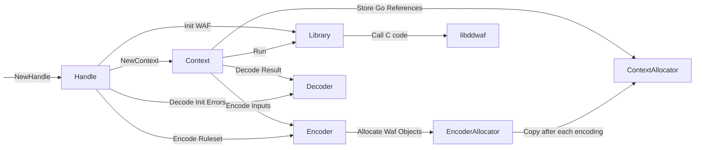

# go-libddwaf

This project's goal is to produce a higher level API for the go bindings to [libddwaf](https://github.com/DataDog/libddwaf): DataDog in-app WAF.
It consist of 2 separate entities: the bindings for the calls to libddwaf, and the encoder whose job is to convert _any_ go object to an object ingestable by libddwaf.

An example usage would be:

```go
import waf "github.com/DataDog/go-libddwaf"

//go:embed
var ruleset []byte

func main() {

	var parsedRuleset any

	if err := json.Unmarshal(ruleset, &parsedRuleset); err != nil {
        return 1
    }

	wafHandle, err := waf.NewHandle(parsedRuleset, "", "")
    if err != nil {
        return 1
    }

	defer wafHandle.Close()

    wafCtx := wafHandle.NewContext()
    defer wafCtx.Close()

	matches, actions := wafCtx.Run(map[string]any{
		"server.request.path_params": "/rfiinc.txt",
	}, time.Minute)
}
```

The API documentation details can be found on [pkg.go.dev](https://pkg.go.dev/github.com/DataDog/go-libddwaf).

Originally this project was only here to provide CGO Wrappers to the calls to libddwaf.
But with the API evolution of the Waf, the appearance of Waf Objects used be able to create more easily bindings in a variety of languages,
but also with the intention to build CGO-less bindings, this project size has grown to be a fully integrated brick in the DataDog tracer structure.
Which then in turn made necessary some documents on the project to maintain it in an orderly fashion.

## Design

The WAF bindings have multiple moving parts that are necessary to understand:

- Handle: a object wrapper over the pointer on the C WAF Handle
- Context: a object wrapper over a pointer in the C WAF Context
- Encoder: whose goal is to construct a tree of Waf Objects to send to the WAF
- Allocator: Does all writing and allocation operations for the construction of Waf Objects
- Decoder: Transform Waf Objects returned from the WAF to usual go objects (e.g. maps, arrays, ...)
- Library: The library which wraps all calls to C code



### Typical call to Run()

Here is an example of the flow of operations on a simple call to Run():

- Encode input data into Waf Objects
- Lock the context mutext until the end of the call
- Call `ddwaf_run`
- Decode the matches and actions

### CGO-less C Bindings

The main component used to build C bindings without using CGO is called [purego](https://github.com/ebitengine/purego). The flow of execution on our side is to embed the C shared library using `go:embed`. Then to dump it into a file, load it using `dlopen` and to load the symbols using `dlsym`. And finally to call them.

⚠️ Keep in mind that __purego only works on linux/darwin for amd64/arm64 and so does go-libddwaf.__

Another requirement because of this to have a FHS filesystem on your machine and, for linux, to provide `libc.so.6`, `libpthread.so.0` and `libm.so.6` as dynamic libraries.

## Contributing usual pitfalls

- Cannot dlopen twice in the app lifetime on OSX
- `runtime.KeepAlive()` calls are here to prevent the GC from destroying objects too early
- Since there is a stack switch between the go code and the C code. Usually the only C stacktrace you will ever get is from gdb
- If a segfault happens during a call to the C code. The goroutine stacktrace which has done the call is the one annotated with `[syscall]`.
- [GoLand](https://www.jetbrains.com/go/) does not support `CGO_ENABLED=0` (as of June 2023)
- Keep in mind that we fully escape the type system. So if you send the wrong data it will segfaults in the best cases but not always!
- The structs in `ctypes.go` are here to reproduce the memory layout of the structs in `include/ddwaf.h` because pointer to these structs will be passed directly.
- Limit as much as possible the use of `unsafe.Pointer` and `uintptr` because they escape the pointer analysis which can create wrongly optimized code.
